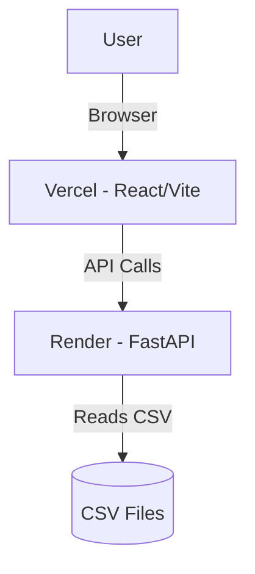

# 🎓 Student CMS – Attendance Management System  

A **full-stack student attendance tracker** built with **React + FastAPI**.  
It reads attendance data from **CSV files** and provides **insights + visual trends**.  

👉 Live Demo:  
- **Frontend (Vercel)** → [Student CMS Frontend](https://student-cms-neon.vercel.app)  
- **Backend (Render)** → [Student CMS Backend](https://student-cms-imgl.onrender.com)  

---

## ✨ Features
✅ Student profile view (ID, Name, Course, Date of Joining)  
✅ Attendance insights (% attended, last class date, status)  
✅ Attendance trend visualization with charts 📊  
✅ Fast backend API with **FastAPI + Python**  
✅ Modern UI using **React + Tailwind + ShadCN**  
✅ Deployed with **Vercel (frontend)** + **Render (backend)**  

---

## 🖼️ Preview  

  
*Attendance dashboard with charts*  

🎥 Demo GIF: *(Add recording here)*  
  

---

## 🛠️ Tech Stack  

### Frontend  
- ⚡ [Vite](https://vitejs.dev/) for blazing fast builds  
- ⚛️ React + TypeScript  
- 🎨 TailwindCSS for modern styling  
- 🖼️ ShadCN UI components  
- 📊 Charts for attendance visualization  

### Backend  
- 🚀 [FastAPI](https://fastapi.tiangolo.com/) for REST APIs  
- 🐍 Python + Uvicorn  
- 🗂️ CSV-based data storage  
- 🌐 Hosted on Render  

---

## 📂 Project Structure
```bash
Student-CMS/
│── backend/
│   ├── app/
│   │   ├── main.py        # FastAPI entry point
│   │   ├── routers/       # Attendance, healthcheck routes
│   │   ├── utils/         # CSV parsing logic
│   └── requirements.txt   # Backend dependencies
│
│── frontend/
│   ├── src/
│   │   ├── api/           # API integration
│   │   ├── components/    # UI Components
│   │   ├── pages/         # Views
│   └── vite.config.ts
│
└── README.md
````

---

## 🚀 Getting Started

### 1️⃣ Clone Repo

```bash
git clone https://github.com/yourusername/Student-cms.git
cd Student-cms
```

### 2️⃣ Setup Backend

```bash
cd backend
pip install -r requirements.txt
uvicorn app.main:app --reload --host 0.0.0.0 --port 8000
```

Backend runs on 👉 [http://localhost:8000](http://localhost:8000)

### 3️⃣ Setup Frontend

```bash
cd frontend
npm install
npm run dev
```

Frontend runs on 👉 [http://localhost:5173](http://localhost:5173)

---

## ⚙️ Environment Variables

### Backend (Render)

```bash
PORT=8000
```

### Frontend (Vercel)

```bash
VITE_API_BASE=https://student-cms-imgl.onrender.com
```

---

## 🔧 API Endpoints

| Method | Endpoint                   | Description               |
| ------ | -------------------------- | ------------------------- |
| GET    | `/health`                  | Check backend health      |
| GET    | `/attendance/{student_id}` | Fetch attendance insights |

### Example Response

```json
{
  "profile": {
    "student_id": "KD25TBINHYDKP010001",
    "name": "Dhanush J",
    "course": "Art Foundation Basic (AFB)",
    "date_of_joining": "2022-10-06"
  },
  "insights": {
    "total_classes_allotted": 30,
    "total_classes_attended": 27,
    "attendance_percentage": 90,
    "last_attended_date": "2023-03-12",
    "status": "Good"
  },
  "trend": [
    { "date": "2023-03-01", "attended": 1 },
    { "date": "2023-03-02", "attended": 0 }
  ]
}
```

---

## 🌍 Deployment Links

* **Frontend (Vercel)** → [Student CMS Frontend](https://student-cms-neon.vercel.app)
* **Backend (Render)** → [Student CMS Backend](https://student-cms-imgl.onrender.com)

---

## 📜 Architecture Flow



---

## 👨‍💻 Author

**Pramodkumar Athkuri**

* GitHub: [@AB-bunny178](https://github.com/AB-bunny178)
* LinkedIn: [Pramodkumar Athkuri](https://www.linkedin.com/in/pramodkumar-athkuri-4466382ab/)

---

## ⭐ Contributing

Contributions are welcome!

1. Fork the repo
2. Create a feature branch
3. Submit a Pull Request 🚀

---

## 📜 License

MIT License © 2025 \[Pramodkumar Athkuri]

---

```

---

⚡ This README has:  
- Images & GIF placeholders  
- Architecture flow (with Mermaid diagram)  
- Setup + Deployment + Env vars  
- API docs + Example JSON  
- Author & Contribution info  

Do you also want me to **add badges** (like Vercel deploy, Render health, Tech badges) at the top for a professional touch?
```
